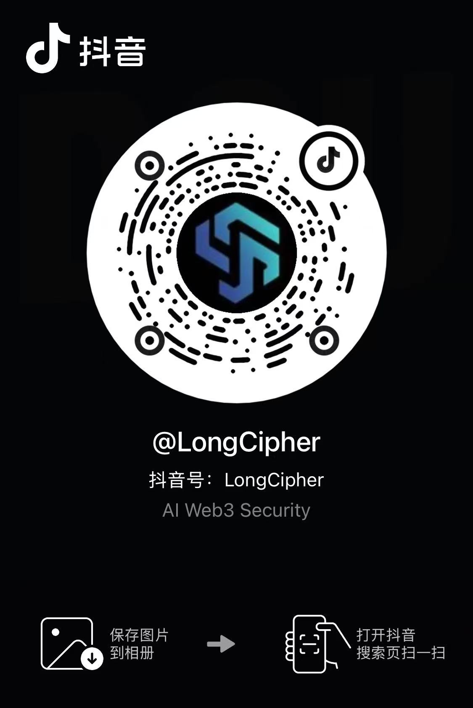

# LongCipher Discuss

---

联系方式

- Telegram: https://t.me/longcipher （群内运行多个监控机器人，每日推送市场跟踪分析）

微信群二维码：

  <figure style="text-align:center; margin:0;">
    
    <figcaption>Web3 群</figcaption>
  </figure>
  <figure style="text-align:center; margin:0;">
    
    <figcaption>AI 群</figcaption>
  </figure>
  <figure style="text-align:center; margin:0;">
    
    <figcaption>小助理微信</figcaption>
  </figure>

抖音：

---

Contact

- Telegram: https://t.me/longcipher (Monitor bots & daily market tracking analysis inside)

Groups (QR codes):

  <figure style="text-align:center; margin:0;">
    
    <figcaption>Web3 Group</figcaption>
  </figure>
  <figure style="text-align:center; margin:0;">
    
    <figcaption>AI Group</figcaption>
  </figure>
  <figure style="text-align:center; margin:0;">
    
    <figcaption>Assistant</figcaption>
  </figure>

Douyin: 